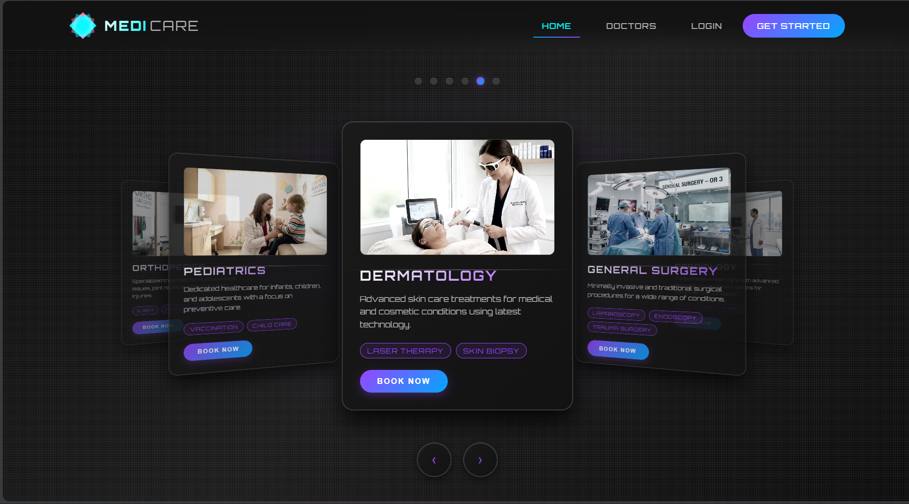
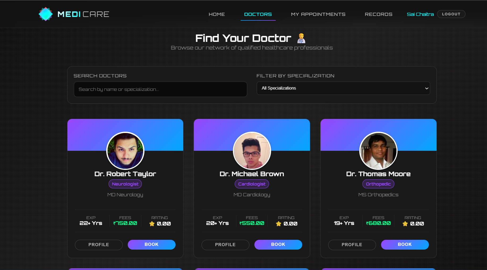
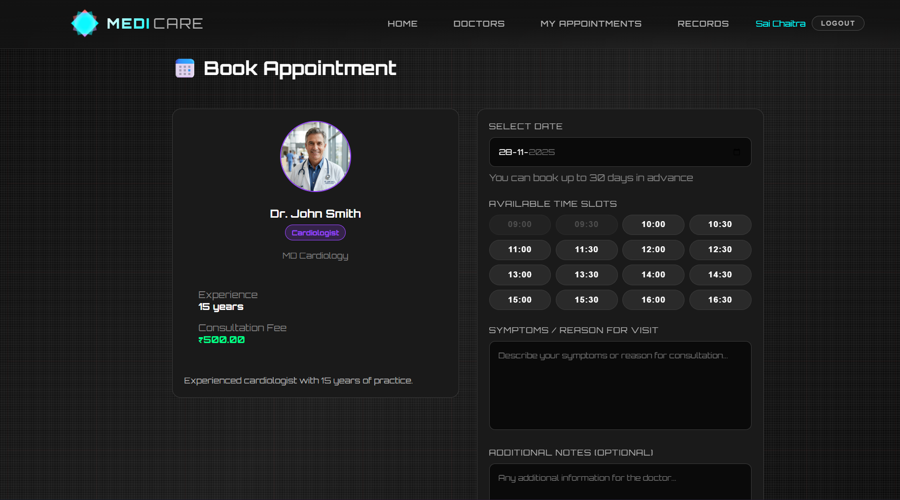
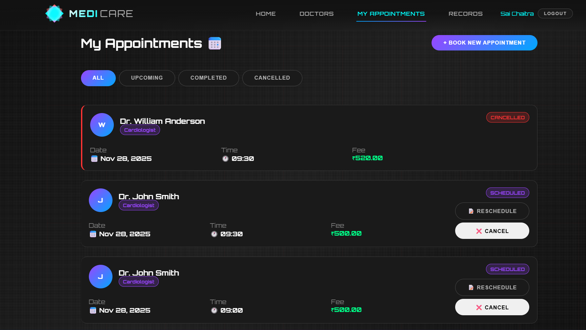

# MediCare - Healthcare Appointment Booking System 

A modern, full-stack web application for healthcare appointment management built with **React**, **Node.js**, **Express**, and **MySQL**.

Developed by **Sai Chaitra Vuggu** for ProU Technology Full-Stack Development Assessment (Track 3).

---

## 🌟 Features

### For Patients

- ✅ **User Registration & Authentication** - Secure signup and login with JWT
- ✅ **Doctor Search & Filtering** - Browse doctors by specialization
- ✅ **Real-Time Slot Booking** - View available time slots and book appointments
- ✅ **Appointment Management** - View, reschedule, and cancel appointments
- ✅ **Medical Records** - Access prescription and medical history
- ✅ **Email Notifications** - Receive appointment confirmations and reminders

### For Doctors

- ✅ **Dashboard Analytics** - View appointment statistics
- ✅ **Appointment Management** - View and manage patient appointments
- ✅ **Schedule Configuration** - Set availability for different days
- ✅ **Medical Record Creation** - Create and update patient records

### For Admins

- ✅ **System Dashboard** - Monitor overall system statistics
- ✅ **User Management** - Manage doctors and patients
- ✅ **Analytics & Reports** - View monthly trends and top doctors

---

## 🛠️ Tech Stack

### Frontend

- **React 18** - Modern UI library
- **React Router** - Client-side routing
- **Axios** - HTTP client
- **React Toastify** - Toast notifications
- **Vite** - Fast build tool
- **CSS3** - Custom design system with modern aesthetics

### Backend

- **Node.js & Express** - Server framework
- **MySQL** - Relational database
- **JWT** - Authentication & authorization
- **Bcrypt** - Password hashing
- **Nodemailer** - Email notifications
- **Express Validator** - Request validation
- **CORS** - Cross-origin resource sharing

---

## 📦 Project Structure

```
medicare-booking-system/
├── backend/
│   ├── config/
│   │   ├── database.js          # MySQL connection pool
│   │   └── initDb.js            # Database initialization script
│   ├── middleware/
│   │   └── auth.js              # JWT authentication middleware
│   ├── routes/
│   │   ├── auth.js              # Authentication routes
│   │   ├── doctors.js           # Doctor management routes
│   │   ├── appointments.js      # Appointment booking routes
│   │   ├── medicalRecords.js    # Medical records routes
│   │   └── admin.js             # Admin dashboard routes
│   ├── utils/
│   │   └── emailService.js      # Email notification service
│   ├── server.js                # Express server entry point
│   ├── package.json
│   └── .env
│
└── frontend/
    ├── src/
    │   ├── components/
    │   │   ├── Navbar.jsx       # Navigation bar
    │   │   └── PrivateRoute.jsx # Protected route wrapper
    │   ├── context/
    │   │   └── AuthContext.jsx  # Authentication context
    │   ├── pages/
    │   │   ├── Home.jsx         # Landing page
    │   │   ├── Login.jsx        # Login page
    │   │   ├── Register.jsx     # Registration page
    │   │   ├── DoctorsList.jsx  # Browse doctors
    │   │   ├── BookAppointment.jsx  # Book appointment
    │   │   └── MyAppointments.jsx   # View appointments
    │   ├── services/
    │   │   └── api.js           # API service layer
    │   ├── App.jsx              # Main app component
    │   ├── main.jsx             # React entry point
    │   └── index.css            # Global styles
    ├── index.html
    ├── vite.config.js
    └── package.json
```

---

## 🚀 Setup Instructions

### Prerequisites

- Node.js (v16 or higher)
- MySQL (v8.0 or higher)
- npm or yarn

### 1. Clone the Repository

```bash
git clone <your-repository-url>
cd medicare-booking-system
```

### 2. Backend Setup

#### Install Dependencies

```bash
cd backend
npm install
```

#### Configure Environment Variables

Create a `.env` file in the `backend` directory:

```env
NODE_ENV=development
PORT=5000

# Database Configuration
DB_HOST=localhost
DB_USER=root
DB_PASSWORD=your_mysql_password
DB_NAME=medicare_db

# JWT Secret
JWT_SECRET=your_super_secret_jwt_key_change_this

# Email Configuration (Optional - for notifications)
EMAIL_HOST=smtp.gmail.com
EMAIL_PORT=587
EMAIL_USER=your_email@gmail.com
EMAIL_PASSWORD=your_app_specific_password

# Frontend URL
FRONTEND_URL=http://localhost:3000
```

#### Initialize Database

```bash
npm run init-db
```

This will create the database, all tables, and seed sample data including:

- **Admin**: `admin@medicare.com` / `admin123`
- **Doctors**: `dr.smith@medicare.com` / `doctor123`
- **Patient**: `patient@example.com` / `patient123`

#### Start Backend Server

```bash
npm run dev
```

The server will run on **http://localhost:5000**

---

### 3. Frontend Setup

#### Install Dependencies

```bash
cd frontend
npm install
```

#### Configure Environment (Optional)

Create `.env` file in `frontend` directory if API URL is different:

```env
VITE_API_URL=http://localhost:5000/api
```

#### Start Frontend Development Server

```bash
npm run dev
```

The application will run on **http://localhost:3000**

---

## 📸 Screenshots

### 1. Landing Page


_Modern hero section with features and call-to-action_

### 2. Doctor Browse


_Search and filter doctors by specialization_

### 3. Appointment Booking


_Real-time slot availability with calendar_

### 4. Patient Dashboard


_View and manage appointments_

---

## 🎥 Demo Video

[View Screen Recording](link-to-screen-recording)

---

## 🔑 Test Credentials

### Admin Account

- Email: `admin@medicare.com`
- Password: `admin123`

### Doctor Accounts

- Dr. Smith (Cardiologist): `dr.smith@medicare.com` / `doctor123`
- Dr. Patel (Dermatologist): `dr.patel@medicare.com` / `doctor123`
- Dr. Kumar (Orthopedic): `dr.kumar@medicare.com` / `doctor123`

### Patient Account

- Email: `patient@example.com`
- Password: `patient123`

---

## 🗄️ Database Schema

### Users Table

Stores all user information (patients, doctors, admins)

### Patients Table

Extended information for patient profiles

### Doctors Table

Professional information for doctors (specialization, fees, etc.)

### Appointments Table

Appointment bookings with date, time, and status

### Medical Records Table

Patient medical history and prescriptions

### Doctor Schedules Table

Doctor availability by day of week

### Notifications Table

System notifications for users

---

## 🔒 Security Features

- ✅ **Password Hashing** - Bcrypt with salt rounds
- ✅ **JWT Authentication** - Secure token-based auth
- ✅ **Role-Based Access Control** - Protected routes based on user roles
- ✅ **Input Validation** - Server-side validation for all inputs
- ✅ **SQL Injection Prevention** - Parameterized queries
- ✅ **CORS Configuration** - Controlled cross-origin requests

---

## ✨ Bonus Features Implemented

### ✅ Deployment Ready

- Environment-based configuration
- Production build scripts
- Optimized assets

### ✅ Email Notifications

- Appointment confirmations
- Cancellation notifications
- Beautiful HTML email templates

### ✅ Advanced UI/UX

- Modern gradient design
- Smooth animations and transitions
- Responsive layout
- Toast notifications
- Loading states

### ✅ Real-Time Features

- Live slot availability checking
- Conflict prevention
- Status updates

### ✅ Analytics Dashboard

- System statistics
- Monthly trends
- Top doctors by appointments

---

## 🚀 Deployment

### Backend Deployment (Railway/Render)

1. Create a new project on Railway or Render
2. Connect your GitHub repository
3. Set environment variables
4. Deploy

### Frontend Deployment (Netlify/Vercel)

1. Build the frontend:
   ```bash
   cd frontend
   npm run build
   ```
2. Deploy the `dist` folder to Netlify or Vercel

### Database

Use a managed MySQL service like:

- AWS RDS
- PlanetScale
- Railway MySQL

---

## 📝 API Documentation

### Authentication

- `POST /api/auth/register` - Register new user
- `POST /api/auth/login` - User login
- `GET /api/auth/me` - Get current user profile

### Doctors

- `GET /api/doctors` - Get all doctors (with filters)
- `GET /api/doctors/:id` - Get doctor details
- `GET /api/doctors/specializations/list` - Get all specializations

### Appointments

- `GET /api/appointments` - Get appointments (role-based)
- `POST /api/appointments` - Book new appointment
- `GET /api/appointments/available-slots/:doctorId/:date` - Get available slots
- `PATCH /api/appointments/:id/status` - Update appointment status

### Medical Records

- `GET /api/medical-records` - Get medical records
- `POST /api/medical-records` - Create medical record
- `GET /api/medical-records/:id` - Get record details

### Admin

- `GET /api/admin/stats` - Get dashboard statistics
- `GET /api/admin/users` - Get all users
- `PATCH /api/admin/users/:id/toggle-status` - Toggle user status

---

## 🧪 Testing

### Manual Testing

1. Register as a patient
2. Browse doctors and view profiles
3. Book an appointment
4. View appointment in dashboard
5. Cancel an appointment
6. Login as different roles to test access control

---

## 🎯 Future Enhancements

- [ ] Video consultation integration
- [ ] Prescription management
- [ ] Payment gateway integration
- [ ] Multi-language support
- [ ] Mobile app (React Native)
- [ ] Advanced search with location
- [ ] Doctor reviews and ratings
- [ ] Chat feature between doctor and patient

---

## 📧 Contact

**Name**: Sai Chaitra Vuggu  
**Email**: your.email@example.com  
**GitHub**: [Your GitHub Profile]  
**LinkedIn**: [Your LinkedIn Profile]

---

## 📄 License

This project was created for educational purposes as part of ProU Technology's Full-Stack Development Assessment.

---

## 🙏 Acknowledgments

- ProU Technology for this assessment opportunity
- React and Node.js communities for excellent documentation
- All open-source libraries used in this project

---

**Note**: This is a demonstration project created for assessment purposes. For production use, additional security measures, error handling, and testing should be implemented.
